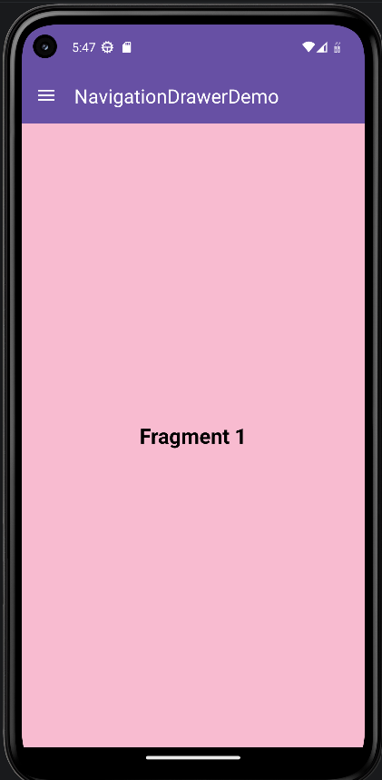
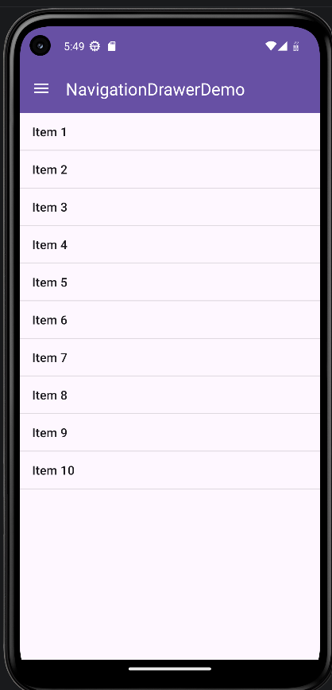

# NavigationDrawerDemo

[](https://developer.android.com)
[](https://opensource.org/licenses/MIT)

Une démonstration propre et professionnelle d'une application Android implémentant un **Navigation Drawer** (Menu latéral) utilisant les composants modernes de Material Design et la gestion des Fragments.

## 📱 Fonctionnalités

- **Navigation Drawer Material Design :** Intégration fluide d'un menu latéral utilisant `NavigationView` et `DrawerLayout`.
- **Gestion des Fragments :** Basculement dynamique entre plusieurs fragments (`BlankFragment`, `BlankFragment2` et `FragmentList`) sans recharger l'Activité.
- **Barre d'outils personnalisée :** Intégration avec `androidx.appcompat.widget.Toolbar` pour une expérience utilisateur cohérente.
- **Implémentation de ListFragment :** Illustre comment afficher des listes interactives au sein de l'architecture de navigation.
- **Design Réactif :** Gère les événements du bouton retour pour fermer le menu et s'adapte correctement aux fenêtres système.

## 🚀 Pour commencer

### Prérequis

- Android Studio Flamingo | 2022.2.1 ou plus récent
- SDK Android Niveau 34 (Target SDK)
- Gradle 8.0 ou plus récent

### Installation

1. Cloner le dépôt :
   ```bash
   git clone https://github.com/Sultan-zd/Lab10-NavigationDrawerDemo.git
   ```
2. Ouvrir le projet dans **Android Studio**.
3. Laisser Gradle synchroniser et construire le projet.
4. Exécuter l'application sur un émulateur ou un appareil physique.

## 🛠 Technologies utilisées

- **Langage :** Java
- **Framework UI :** Jetpack (AppCompat, ConstraintLayout, Fragment)
- **Design :** Material Components pour Android
- **Système de construction :** Gradle (Kotlin DSL)

## 📂 Structure du projet

- `MainActivity.java` : L'activité principale gérant la disposition du menu latéral et les transactions de fragments.
- `FragmentList.java` : Implémentation de `ListFragment` pour démontrer la gestion des données sous forme de liste.
- `res/layout/` :
    - `activity_main.xml` : Mise en page principale contenant `DrawerLayout` et `NavigationView`.
    - `nav_header_main.xml` : La vue d'en-tête pour le menu de navigation latéral.
    - `content_main.xml` : La zone de contenu principale où les fragments sont hébergés.
- `res/menu/` :
    - `activity_main_drawer.xml` : Définition des éléments du menu pour le tiroir latéral.

## 📸 Captures d'écran

| Menu Latéral | Liste de Fragments |
|:---:|:---:|
|  |  |

*(Remplacez par de réelles captures d'écran de votre projet)*

## 📄 Licence

Distribué sous la licence MIT. Voir `LICENSE` pour plus d'informations.

---
Développé par [Sultan-zd](https://github.com/Sultan-zd)
